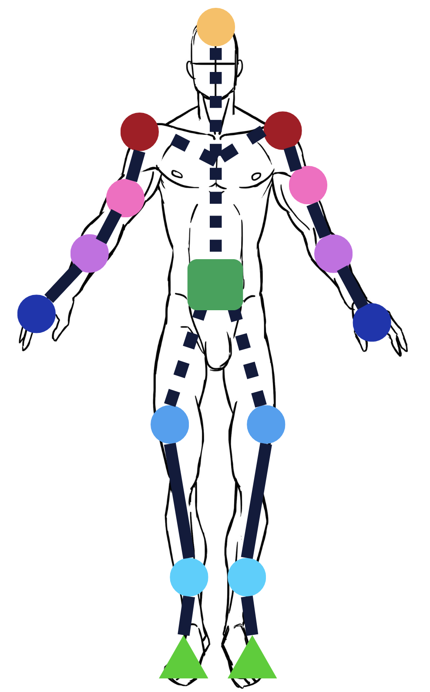
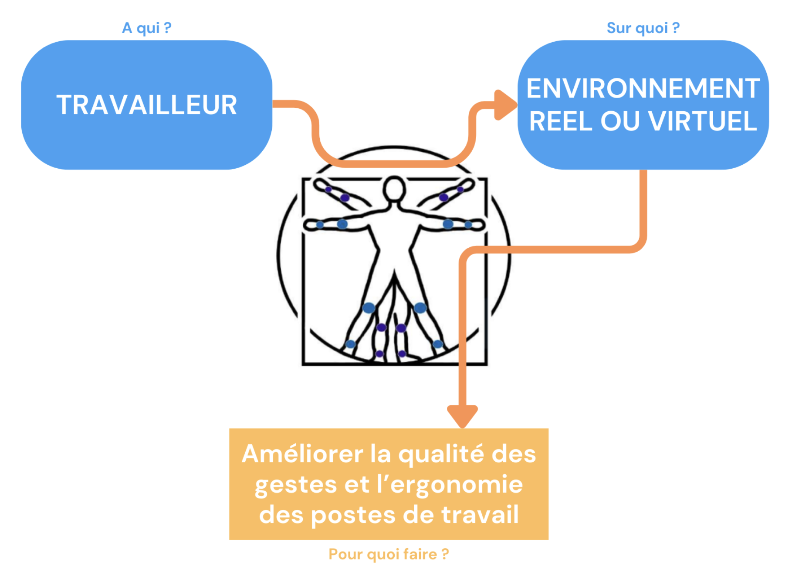
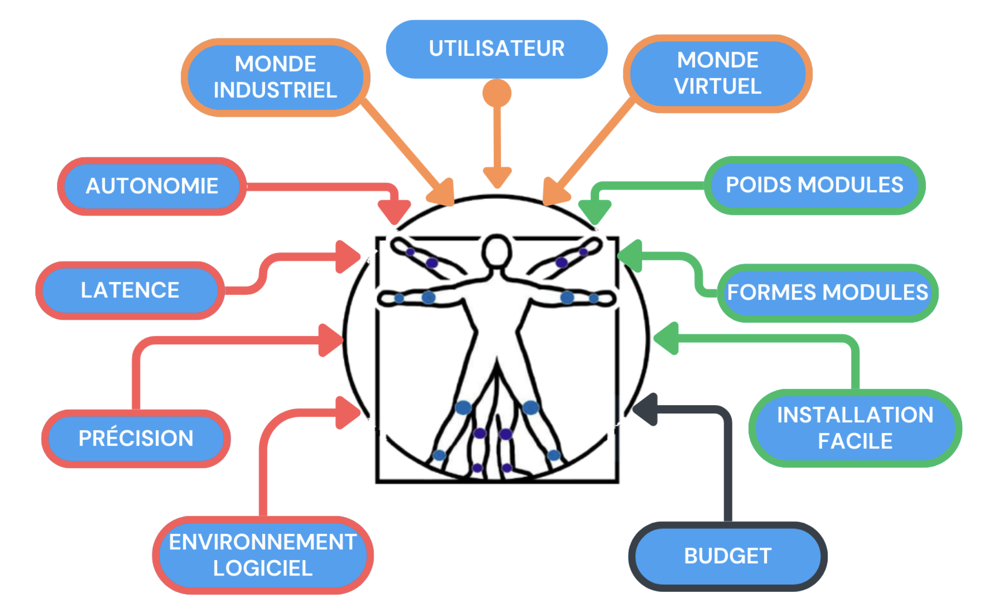

<h1 align="center"><b>VR-GoCapt</b></h1>
<p align="center"><i>Smart sensor equiment designed for VR</i></p>
<p align="center">
     
    
    
    
      
</p>

## Description

Le projet consiste à la réalisation d’un système de capteurs **amovibles** de repérage des positions de différentes parties du corps afin d'en faire une simulation en réalité virtuelle.

<div align="center" style="display: flex; justify-content: center; align-items: center; flex-direction:row;">
     
</div>

Ce système permet à un individu travaillant en milieu industriel d'améliorer la qualité de ses gestes à partir d’une récupération de données via un support externe et en temps réel.

<div align="center" style="display: flex; justify-content: center; align-items: center; flex-direction:row">
  <div style="flex: 1;">
      
      
    <p>Analyse du besoin du système</p>
  </div>
</div>

## Data Extraction

The data is sent to a router using UDP protocol.
In the mean time, all the data is saved on an SD card in the json format. The data is saved in the following format:

```json
{
    [
        "name": "headers",
        "data": {
            "time": 0,
            "tete": 1,
            "dos": 2,
            "epaule_droite": 3,
            "bras_droit": 4,
            "avant_bras_droit": 5,
            "main_droite": 6,
            "epaule_gauche": 7,
            "bras_gauche": 8,
            "avant_bras_gauche": 9,
            "main_gauche": 10,
            "ceinture": 11,
            "cuisse_droite": 12,
            "tibia_droit": 13,
            "pied_droit": 14,
            "cuisse_gauche": 15,
            "tibia_gauche": 16,
            "pied_gauche": 17,
        }
    ],
    [
        "name": "sensors",
        "data": {
            [
                "<time>",
                "<sensor_i_x>",
                "<sensor_i_y>",
                "<sensor_i_z>",
                "<sensor_i_accx>",
                "<sensor_i_accy>",
                "<sensor_i_accz>",
                "..."
            ]
        }
    ]
}
```

## Contributing

This project is currently being developed solely by our team. However, **we welcome contributions from the community**. If you'd like to become a contributor, **feel free to submit** pull requests, report issues, or offer suggestions. Your input is valuable and greatly appreciated as we work together to improve this project.

## About us

We are a team of 5 engineering students from Télécom Physique Strasbourg, a French engineering school. We are currently in our 2nd year of studies and we are working on a project called VR-GoCapt. This project is part of our studies and is a 6-month project. We are working on this project from October 2023 to April 2024.


- [**Emilie Ferreira**](https://www.linkedin.com/in/emilie-ferreira-96755721b/) - Project Manager
- [Farah Gherir](https://www.linkedin.com/in/farah-gherir-17ab21268/) - Quality Manager
- [Nathan Lebas](https://www.linkedin.com/in/nathan-lebas-a6486619a/) - Communication Manager
- [Nathan Grillet-Niess](https://www.linkedin.com/in/natgrn/) - Technical Manager
- [Loïs Gallaud](https://www.linkedin.com/in/loisgallaud/) - Software Manager

## License

This project is licensed under the MIT License - see the [LICENSE](LICENSE) file for details.

## Acknowledgments

We extend our heartfelt gratitude to [Thierry Blandet](https://www.researchgate.net/profile/Thierry-Blandet) and Romaric Mathis from the [IGG](https://igg.icube.unistra.fr/en/index.php/Main_Page) team for entrusting us with this project and their invaluable contributions. Special thanks to Ms. [Jelila LABED](https://ieeexplore.ieee.org/author/37586456700) for her unwavering support and guidance. We also thank Mr. Piotr Szychowiak and the entire management team for their insightful feedback.

We appreciate the assistance of Norbert DUMAS and Baptiste GOMES for their guidance and access to the Fablab equipment. Lastly, we thank the engineering projects teams PI05 and PI06 of the 2021/2022 session for their assistance.

These collaborations enriched our experience and contributed to our project's success.
