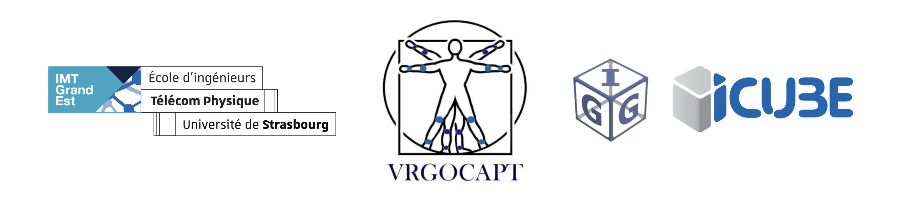

<!--markdownlint-disable-file MD033-->
<!--markdownlint-disable-file MD041-->

<h1 align="center"><b>VR-GoCapt</b></h1>
<p align="center" style="font-size: 1.2rem; color: #888; font-style: italic;">
Equipement de capteurs intelligents conçu pour la VR
</p>
<!-- <p align="center"><i>Smart sensor equiment designed for VR</i></p> -->
<p align="center">
    
    
    
    
      
</p>

## Description

Le projet consiste à la réalisation d’un système de capteurs amovibles. Ils devront repérer les positions des différentes parties du corps et mesurer la charge portée par l'utilisateur afin d'en faire une simulation en réalité virtuelle. Ce système permet à un individu travaillant en milieu industriel d'améliorer la qualité de ses gestes à partir d’une récupération de données via un support externe ou en temps réel.

L’objectif principal de ce projet consiste à réaliser un équipement permettant d’intéragir avec une plateforme de réalité virtuelle dans un milieu industriel afin d’améliorer la qualité des gestes et l’ergonomie des postes de travail. Pour se faire, la demande du client est de concevoir un équipement amovible permettant de visualiser les mouvements, avec ou sans charge. Le projet devra répondre à différentes contraintes : le poids du système, sa portabilité ou encore la précision du dispositif. Une fois réalisé, ce système sera testé en milieu industriel.

<div align="center" style="display: flex; justify-content: center; align-items: center; flex-direction:column; margin-top: 4rem;">
    
    <p style="font-size: 0.9rem; margin-top: 0.5rem; color: #888; font-style: italic; text-align: center;"
    >Représentation du squelette humain</p>

</div>

## Abstract

The project involves the creation of a removable sensor system. These sensors will be able to detect the positions of different body parts and measure the load borne by the user to simulate them in virtual reality. This system allows an individual working in an industrial environment to improve the quality of their movements based on data retrieval through an external support or in real-time.

The main objective of this project is to create equipment that can interact with a virtual reality platform in an industrial environment to improve the quality of movements and the ergonomics of workstations. To achieve this, the client's requirement is to design a removable equipment that allows visualizing movements, with or without load. The project must meet various constraints: the weight of the system, its portability, or the accuracy of the device. Once completed, this system will be tested in an industrial setting.

## Analyse du besoin

Le projet consiste à la réalisation d’un système de capteurs **amovibles** de repérage des positions de différentes parties du corps afin d'en faire une simulation en réalité virtuelle.

<div align="center" style="display: flex; justify-content: center; align-items: center; flex-direction:row">
  <div style="flex: 1;">
      
      
    <p>Analyse du besoin du système</p>
  </div>
</div>

## Extraction des données

Les données sont extraites des capteurs inertiels et des capteurs de charge situés dans les chaussures. Les données sont envoyées à un routeur via le protocole UDP. En parallèle, toutes les données sont sauvegardées sur une carte SD.

Pour que la personne qui est chargée de l'analyse des données puisse les exploiter, il est nécessaire de lui envoyer un glossaire des données. Ce glossaire est une liste de données envoyées en en-tête de chaque fichier de données ou de chaque début de transmission UDP. Il permet de savoir quelles données sont envoyées et dans quel ordre.

```txt
[
    "lShoulder", "lArm", "lForearm", "lHand",   // CHAN0
    "lThigh", "lLeg", "lFoot", "NaS",           // CHAN1
    "rThigh", "rLeg", "rFoot", "NaS",           // CHAN2
    "head", "back", "belt", "NaS",              // CHAN3
    "rShoulder", "rArm", "rForearm", "rHand",   // CHAN4

],
[
    "time",
    "magx","magy","magz",
    "accx","accy","accz",
    "gyrx","gyry","gyrz",
],
... // Sensors data
```

## Contributions

Ce projet est actuellement développé uniquement par notre équipe. Cependant, **nous accueillons favorablement les contributions de la communauté**. Si vous souhaitez devenir contributeur, **n'hésitez pas à soumettre** des pull-requests, à signaler des problèmes ou à faire des suggestions. Votre contribution est précieuse et grandement appréciée alors que nous travaillons ensemble pour améliorer ce projet.

## A propos

Nous sommes une équipe de 5 étudiants ingénieurs de Télécom Physique Strasbourg, une école d'ingénieurs française. Nous sommes actuellement en 2ème année d'études et nous travaillons sur un projet appelé VR-GoCapt. Ce projet fait partie de nos études et est un projet de 6 mois. Nous travaillons sur ce projet d'octobre 2023 à avril 2024.


- [**Emilie Ferreira**](https://www.linkedin.com/in/emilie-ferreira-96755721b/) - Project Manager
- [Loïs Gallaud](https://www.linkedin.com/in/loisgallaud/) - Software Manager
- [Farah Gherir](https://www.linkedin.com/in/farah-gherir-17ab21268/) - Quality Manager
- [Nathan Lebas](https://www.linkedin.com/in/nathan-lebas-a6486619a/) - Communication Manager
- [Nathan Grillet-Niess](https://www.linkedin.com/in/natgrn/) - Technical Manager

## License

This project is licensed under the MIT License - see the [LICENSE](LICENSE) file for details.

## Remerciements

Nous tenons à exprimer notre gratitude à [Thierry Blandet](https://www.researchgate.net/profile/Thierry-Blandet) et Romaric Mathis de l'équipe [IGG](https://igg.icube.unistra.fr/en/index.php/Main_Page) pour nous avoir confié ce projet et pour leurs contributions inestimables. Un grand merci à Mme [Jelila LABED](https://ieeexplore.ieee.org/author/37586456700) pour son soutien indéfectible et ses conseils. Nous remercions également M. Piotr Szychowiak et toute l'équipe de direction pour leurs commentaires éclairés.

Nous apprécions l'aide de Norbert Dumas, Baptiste Gomes, Loïs C uvillon et Morgan Madec pour leur accompagnement et l'accès à l'équipement du Fablab. Enfin, nous remercions les équipes de projets d'ingénierie PI05 et PI06 de la session 2021/2022 pour leur aide.

Ces collaborations ont enrichi notre expérience et contribué au succès de notre projet.
